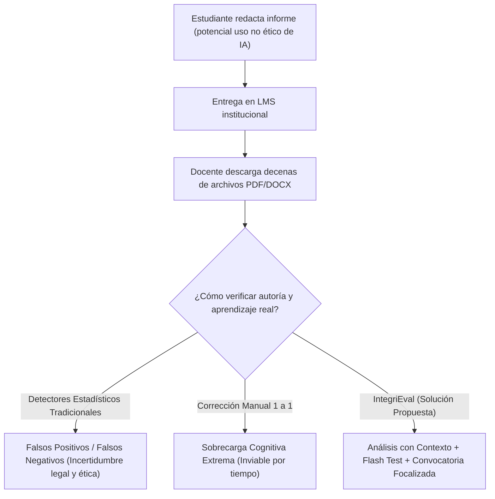

# Documento de Ingeniería de Software y Especificación de Proyecto: IntegriEval

**Proyecto:** IntegriEval — Sistema Semi-Automatizado de Evaluación de Integridad Académica, Detección de IA y Verificación Oral Flash  
**Autores:** Equipo de Desarrollo Estudiantil  
**Fecha:** Agosto 2026  
**Versión:** 2.1.0  

---

## 1. Definición Clara del Problema (10%)

### 1.1 Contexto y Antecedentes
La adopción masiva y acelerada de Modelos de Lenguaje Grande (LLMs, por sus siglas en inglés), como Claude, GPT-4 y Gemini, ha transformado drásticamente la educación superior. Si bien estas herramientas ofrecen capacidades analíticas y creativas sin precedentes, han desencadenado una crisis en los métodos tradicionales de evaluación académica basados en informes, ensayos y tareas domiciliarias escritas.

Actualmente, las universidades utilizan plataformas de gestión de aprendizaje (LMS como Moodle, Canvas o Blackboard) donde los estudiantes entregan sus trabajos en formatos digitales (PDF o DOCX). Los docentes y ayudantes se enfrentan al reto de evaluar cientos de páginas escritas sin contar con mecanismos fiables para discernir entre el aprendizaje genuino del estudiante y la generación íntegra o no atribuida de texto mediante IA.



### 1.2 Descripción del Problema
El problema central se articula en torno a tres factores críticos:

1. **Inviabilidad y Riesgo de los Detectores de IA Tradicionales de 'Caja Negra':**
   Herramientas como Turnitin AI Detector o GPTZero basan su dictamen en perplejidad y ráfagas estadísticas (*burstiness*). Diversos estudios académicos han demostrado que estos detectores poseen tasas elevadas de **falsos positivos** (penalizando injustamente a hablantes no nativos o textos técnicos muy formales) y **falsos negativos** (fácilmente eludibles mediante parafraseo o *prompt engineering*). Acusar formalmente a un estudiante basándose exclusivamente en un porcentaje opaco acarrea serios problemas éticos y disciplinarios.

2. **Inviabilidad del Control Presencial Universal:**
   La alternativa infalible para verificar autoría es la defensa oral presencial o interrogación individual. Sin embargo, evaluar oralmente al 100% de los estudiantes en cursos universitarios masivos (60 a 200 alumnos por cátedra) es logísticamente imposible debido a la restricción horaria de los docentes.

3. **Sobrecarga en la Revisión Rúbrica-Material:**
   Los docentes invierten hasta 25 horas semanales corrigiendo manualmente informes, contrastándolos con la pauta y la bibliografía del curso, labor repetitiva que dilata la retroalimentación formativa y merma la calidad pedagógica.

### 1.3 Justificación de Relevancia e Impacto
- **Impacto Ético y Académico:** Garantizar que los títulos otorgados por las instituciones de educación superior certifiquen competencias y habilidades cognitivas reales, preservando la validez del proceso evaluativo.
- **Impacto Operativo:** Reducir en más de un 60% el tiempo invertido por los cuerpos docentes en la corrección mecánica y en la identificación de casos sospechosos.
- **Impacto Económico y de Accesibilidad:** Proveer una solución de código abierto y bajo costo de despliegue (MVP de bajo presupuesto para universidades de Latinoamérica) que no requiera suscripciones SaaS prohibitivas ni infraestructuras complejas.

### 1.4 Percepción de las Partes Interesadas (Stakeholders)

| Parte Interesada | Percepción / Dolores Identificados (*Pains*) | Expectativas y Validación de Relevancia |
|---|---|---|
| **Profesores Titulares** | *"No sé si el alumno aprendió o si apretó un botón en ChatGPT. No tengo tiempo de interrogar a 80 alumnos, pero no puedo acusar a nadie solo porque un software me dice 85% de plagio."* | Requieren una herramienta de apoyo que entregue una nota preliminar justificada, un pool de preguntas personalizado y gestione citas solo para casos anómalos o aleatorios de control. |
| **Ayudantes / TAs** | *"Revisar 100 PDFs idénticos es agotador. Se nos pasa el plagio entre compañeros o el texto copiado de internet."* | Desean poder subir todos los trabajos en lote y contar con resúmenes ejecutivos en Markdown de cada informe. |
| **Estudiantes** | *"Es frustrante que una máquina te acuse de usar IA cuando te esforzaste. Si hay dudas sobre mi trabajo, prefiero que me hagan preguntas sobre lo que yo mismo escribí para demostrar que lo domino."* | Exigen un proceso justo, transparente, sin fricción de cuentas adicionales, y la oportunidad de defender su calificación de forma oral. |
| **Directores de Carrera / Decanaturas** | *"Necesitamos resguardar la reputación de los egresados y evitar litigios por acusaciones infundadas de deshonestidad académica."* | Validan la necesidad de registros de auditoría (*audit trail*) y defensas orales fundamentadas en evidencia tangible. |

---

## 2. Definición de Objetivos SMART y Matriz de Trazabilidad (25%)

### 2.1 Objetivo General (Corregido y Refinado)

> **Desarrollar una plataforma web para la evaluación semi-automatizada y verificación de autoría de trabajos académicos, combinando análisis de pautas asistido por inteligencia artificial contextualizada, generación interactiva de reactivos flash y agendamiento focalizado de defensas presenciales.**

---

### 2.2 Objetivos Específicos (Criterios SMART Corregidos)

```
┌─────────────────────────────────────────────────────────────────────────────────────────────────────────────────┐
│ OBJETIVO ESPECÍFICO 1 (OE1): Ingesta, Nómina y Normalización Documental                                         │
├─────────────────────────┬───────────────────────────────────────────────────────────────────────────────────────┤
│ Enunciado               │ Implementar un módulo de ingesta masiva de trabajos académicos (PDF/DOCX) y gestión  │
│                         │ de nóminas estudiantiles sin cuentas de acceso, transformando los documentos a formato│
│                         │ Markdown estructurado para su consumo optimizado por modelos de lenguaje.             │
│ Específico (S)          │ Ingesta de nómina por CSV (nombre/correo) y extracción semántica de PDFs a Markdown.  │
│ Medible (M)             │ Tasa de éxito de conversión >= 98% en documentos estándar y procesamiento de lotes de │
│                         │ hasta 100 archivos en una sola operación.                                             │
│ Alcanzable (A)          │ Implementado con `pymupdf4llm` y endpoints asíncronos en FastAPI.                     │
│ Relevante (R)           │ Elimina la fricción de registro para estudiantes y estructura el texto para el LLM.  │
│ Temporizado (T)         │ Completado en el Sprint 1 (Fase de Ingesta).                                          │
└─────────────────────────┴───────────────────────────────────────────────────────────────────────────────────────┘
```

```
┌─────────────────────────────────────────────────────────────────────────────────────────────────────────────────┐
│ OBJETIVO ESPECÍFICO 2 (OE2): Motor de Análisis Contextualizado y Detección de IA                                │
├─────────────────────────┬───────────────────────────────────────────────────────────────────────────────────────┤
│ Enunciado               │ Desarrollar un motor de análisis asistido por IA generativa que contraste los informes│
│                         │ contra la pauta de corrección y el material bibliográfico de la asignatura, generando │
│                         │ una calificación preliminar fundamentada y un índice de detección de texto sintético. │
│ Específico (S)          │ Integración del material de apoyo del curso en el prompt para evaluación cualitativa. │
│ Medible (M)             │ Tiempo de respuesta <= 15 segundos por informe en segundo plano, desglose JSON de     │
│                         │ rúbrica y calibración según 3 niveles de rigor (strict, medium, lax).                 │
│ Alcanzable (A)          │ Mediante workers asíncronos con Claude 3.5 Sonnet y motor de contingencia Mock.       │
│ Relevante (R)           │ Aporta justificación cualitativa y contextual, superando detectores de caja negra.    │
│ Temporizado (T)         │ Completado en el Sprint 2 (Fase de Análisis).                                         │
└─────────────────────────┴───────────────────────────────────────────────────────────────────────────────────────┘
```

```
┌─────────────────────────────────────────────────────────────────────────────────────────────────────────────────┐
│ OBJETIVO ESPECÍFICO 3 (OE3): Generación Dinámica y Supervisión Humana de Reactivos Flash                        │
├─────────────────────────┬───────────────────────────────────────────────────────────────────────────────────────┤
│ Enunciado               │ Diseñar un sistema interactivo de gestión de bancos de preguntas personalizadas por   │
│                         │ estudiante, que permita al docente revisar, editar, añadir reactivos propios y        │
│                         │ despachar pruebas flash mediante enlaces seguros de un solo uso vía correo electrónico│
│ Específico (S)          │ Pool de 20 preguntas derivadas del informe, selector aleatorio y despacho SMTP.       │
│ Medible (M)             │ 100% de preguntas asociadas al informe; despacho de enlaces UUIDv4 con vigencia de 48h│
│                         │ a través de Gmail SMTP gratuito (`aiosmtplib`).                                       │
│ Alcanzable (A)          │ Panel interactivo en Next.js y servicio de correo asíncrono en Python.                │
│ Relevante (R)           │ Asegura el paradigma Human-in-the-Loop antes de enviar las evaluaciones.              │
│ Temporizado (T)         │ Completado en el Sprint 3 (Fase de Reactivos y Despacho).                              │
└─────────────────────────┴───────────────────────────────────────────────────────────────────────────────────────┘
```

```
┌─────────────────────────────────────────────────────────────────────────────────────────────────────────────────┐
│ OBJETIVO ESPECÍFICO 4 (OE4): Evaluación en Tiempo Real y Ruteo Automatizado de Citas                            │
├─────────────────────────┬───────────────────────────────────────────────────────────────────────────────────────┤
│ Enunciado               │ Construir una interfaz de examinación en tiempo real para estudiantes y un algoritmo de│
│                         │ ruteo que asigne citas de defensa presencial en los bloques libres del docente        │
│                         │ exclusivamente para estudiantes con rendimientos atípicos o asignación aleatoria.     │
│ Específico (S)          │ Flash test vía WebSocket cronometrado y agendamiento automático según disponibilidad. │
│ Medible (M)             │ Latencia WebSocket <= 100ms, temporizador estricto por reactivo y agendamiento del    │
│                         │ 100% de estudiantes con score flash < 50%, >= 95% o 10% aleatorio de control.         │
│ Alcanzable (A)          │ WebSockets sobre Starlette/FastAPI y frontend reactivo con Tailwind CSS.              │
│ Relevante (R)           │ Focaliza el tiempo presencial del docente únicamente en defensas necesarias.          │
│ Temporizado (T)         │ Completado en el Sprint 4 (Fase de Examinación y Citas).                              │
└─────────────────────────┴───────────────────────────────────────────────────────────────────────────────────────┘
```

```
┌─────────────────────────────────────────────────────────────────────────────────────────────────────────────────┐
│ OBJETIVO ESPECÍFICO 5 (OE5): Validación Integral, Auditoría y Cierre de Calificaciones                          │
├─────────────────────────┬───────────────────────────────────────────────────────────────────────────────────────┤
│ Enunciado               │ Validar la solución técnica mediante pruebas de integración, paneles de auditoría     │
│                         │ inmutable de acciones docentes y mecanismos de ajuste manual definitivo de notas.     │
│ Específico (S)          │ Trazabilidad de cambios de notas, registro de acuerdos presenciales y audit logs.    │
│ Medible (M)             │ 100% de eventos críticos auditados con timestamp/usuario y tiempo de respuesta de API │
│                         │ <= 200ms en condiciones normales de uso.                                             │
│ Alcanzable (A)          │ Módulo de auditoría estructurado en SQLAlchemy y panel administrativo de métricas.    │
│ Relevante (R)           │ Garantiza la transparencia legal y ética ante apelaciones estudiantiles.              │
│ Temporizado (T)         │ Completado en el Sprint 5 (Fase de Verificación y Cierre).                            │
└─────────────────────────┴───────────────────────────────────────────────────────────────────────────────────────┘
```

---

### 2.3 Matriz de Trazabilidad Actualizada (Problema vs. Objetivos)

| Dimensión del Problema | Causa Raíz Identificada | Objetivo SMART Vinculado | Resultado Entregable Esperado |
|---|---|---|---|
| **Falsos positivos de detectores IA tradicionales** | Dependencia exclusiva de métricas de perplejidad estadística sin validación de comprensión humana. | **OE2 & OE3** | Evaluación contextualizada con material de curso y generación de preguntas de autoría exclusivas del informe. |
| **Imposibilidad de interrogar al 100% de los estudiantes** | Restricción temporal y sobrecarga de horas de atención del docente en cátedras numerosas. | **OE4** | Ruteo automático: solo rinden defensa oral aquellos con flash score $< 50\%$, $\ge 95\%$ o el $10\%$ aleatorio de control. |
| **Fricción operativa en adopción de software** | Resistencia de alumnos a crear nuevas cuentas y recordar credenciales para un único examen. | **OE1 & OE3** | Acceso sin cuenta: el docente carga nómina CSV y el alumno ingresa directamente mediante enlace tokenizado por correo. |
| **Evaluaciones genéricas no interdisciplinarias** | Los modelos de IA evalúan de forma aislada sin conocer los contenidos impartidos en clase. | **OE2** | Módulo de *Materiales de Curso* que inyecta el syllabus y guías docentes en el prompt del evaluador. |
| **Falta de control del docente sobre la IA** | Sistemas de evaluación 100% automáticos que no permiten supervisión humana (*Human-in-the-loop*). | **OE3, OE4 & OE5** | Interfaz interactiva de edición del pool de preguntas y panel para registrar acuerdos de reunión presencial con ajuste de nota. |
| **Presupuesto cero / Entorno estudiantil** | Costos elevados de APIs de correo transaccional (SendGrid, Mailgun) e infraestructuras de pago. | **OE3** | Utilización de Gmail SMTP gratuito (`aiosmtplib`) y arquitectura modular SQLite/FastAPI/Next.js de bajo consumo. |

---

## 3. Análisis Exhaustivo y Justificado de Requerimientos (45%)

### 3.1 Fundamentación Teórica y Estado del Arte
1. **Teoría de la Evaluación Auténtica (Grant Wiggins):**
   La evaluación auténtica sostiene que el aprendizaje real se evidencia cuando el estudiante es capaz de articular, defender y aplicar sus conocimientos en situaciones directas de interrogación. IntegriEval traslada el foco desde *"¿el texto fue escrito por una IA?"* hacia *"¿el estudiante domina y puede responder sobre lo que está escrito en su documento?"*.
2. **Limitaciones Documentadas de los Detectores de IA (Sadasivan et al., 2023; Weber-Wulff et al., 2023):**
   Las pruebas empíricas demuestran que los clasificadores binarios de texto de IA poseen precisiones inferiores al 70% en contextos académicos reales. IntegriEval no utiliza la IA como juez punitivo definitivo, sino como un generador de reactivos que el estudiante debe responder con su propio razonamiento en tiempo real.
3. **Paradigma *Human-in-the-Loop* (HITL):**
   Garantiza que la IA nunca emita una sanción o calificación irrevocable sin la mediación, revisión y aprobación explícita del docente titular.

---

### 3.2 Requerimientos Funcionales (RF)

#### Módulo A: Gestión de Cursos y Estudiantes (Docente)
- **RF01 - Gestión de Asignaturas:** El sistema debe permitir al docente crear, listar y administrar cursos, asociando un nombre, periodo académico e institución.
- **RF02 - Carga Masiva de Nómina (CSV):** El sistema debe procesar archivos `.csv` con nombres y correos institucionales de los estudiantes, omitiendo duplicados y validando sintaxis de email.
- **RF03 - Administración Individual de Estudiantes:** El docente debe poder agregar y eliminar estudiantes de un curso sin requerir que estos creen cuentas con contraseña.

#### Módulo B: Configuración de Parámetros y Materiales de Apoyo
- **RF04 - Configuración de Rúbrica y Rigor:** El docente debe poder definir la pauta de corrección en texto libre, seleccionar el nivel de rigor (`strict`, `medium`, `lax`), definir el tamaño del pool de preguntas (ej. 20) y la cantidad para el flash test (ej. 10).
- **RF05 - Carga de Documentos de Referencia:** El sistema debe permitir subir archivos PDF/DOCX de syllabus, guías y bibliografía (hasta 20MB), convirtiéndolos a Markdown e inyectándolos en el contexto de la IA.
- **RF06 - Calibración de Umbrales de Ruteo:** El docente debe poder configurar los umbrales de llamado a oficina (umbral bajo de defensa, umbral alto de excelencia y porcentaje aleatorio de control).

#### Módulo C: Ingesta en Lote y Motor de Análisis IA
- **RF07 - Subida Masiva de Informes:** El sistema debe permitir al docente subir múltiples PDFs/DOCX en una sola acción, asociando cada archivo con el estudiante correspondiente mediante detección heurística de nombre o mapeo manual.
- **RF08 - Extracción de Alta Fidelidad a Markdown:** El sistema debe transformar los documentos de los alumnos a Markdown preservando títulos, listas, tablas y estructura semántica utilizando `pymupdf4llm`.
- **RF09 - Análisis Asíncrono de Rúbrica y Detección de IA:** El sistema debe evaluar en segundo plano cada trabajo contra la pauta y el material, calculando una nota preliminar (0.0–1.0), un índice de probabilidad de IA y un feedback cualitativo detallado.
- **RF10 - Ajuste Manual de Calificación:** El docente debe poder sobrescribir en cualquier momento la nota preliminar asignada por la IA.

#### Módulo D: Gestión del Pool de Preguntas y Despacho
- **RF11 - Visualización del Pool Completo:** El docente debe poder inspeccionar todos los reactivos de opción múltiple y verdadero/falso generados por la IA para cada estudiante.
- **RF12 - Edición y Creación de Preguntas:** El docente debe poder modificar el enunciado, las alternativas, la respuesta correcta o agregar preguntas personalizadas al banco.
- **RF13 - Selección de Preguntas:** El sistema debe ofrecer selección aleatoria automática de $N$ preguntas según la configuración de la evaluación o permitir la selección manual mediante casillas de verificación.
- **RF14 - Despacho Seguro por Correo Electrónico:** Al aprobar el set, el sistema debe generar un token criptográfico único (UUIDv4) con expiración temporal (ej. 48h) y enviar un correo HTML al estudiante con el enlace directo al Flash Test mediante Gmail SMTP asíncrono (`aiosmtplib`).

#### Módulo E: Flash Test Estudiantil en Tiempo Real
- **RF15 - Acceso Tokenizado sin Autenticación Tradicional:** El estudiante debe acceder al examen únicamente a través de la URL `/flash/[token]`, validando vigencia, unicidad y estado de completitud.
- **RF16 - Examen Cronometrado vía WebSocket:** El sistema debe administrar el flujo de preguntas una a una a través de WebSocket bidireccional, aplicando un temporizador estricto del lado del servidor que penalice timeouts.
- **RF17 - Recuperación de Conexión:** En caso de desconexión accidental, el WebSocket debe restaurar la pregunta activa descontando el tiempo transcurrido para evitar reinicios fraudulentos.
- **RF18 - Calificación y Ruteo Inmediato:** Al finalizar la última pregunta, el sistema debe calcular el puntaje, registrar el estado `completed` y, si califica para revisión (bajo, alto o aleatorio), generar automáticamente la cita en la agenda del docente y notificar por correo al alumno.

#### Módulo F: Agenda de Citas, Disponibilidad y Auditoría
- **RF19 - Gestión de Bloques de Disponibilidad:** El docente debe poder registrar y eliminar sus bloques semanales de atención (día de la semana, hora inicio, hora fin).
- **RF20 - Agendamiento Algorítmico de Citas:** El sistema debe buscar el primer bloque libre en la disponibilidad del docente a partir del día siguiente y persistir la cita.
- **RF21 - Registro de Acuerdos de Cita:** El docente debe poder cerrar la cita presencial, ingresar notas justificativas y ajustar la calificación final del informe.
- **RF22 - Registro de Auditoría (Audit Log):** Todas las acciones críticas (creación de curso, análisis, despacho de correos, cambios de notas) deben quedar registradas con marca de tiempo, usuario y detalles en formato JSON.

---

### 3.3 Requerimientos No Funcionales (RNF)

- **RNF01 - Rendimiento y Concurrencia:** La API construida sobre FastAPI y Starlette debe ser capaz de gestionar hasta 100 conexiones WebSocket concurrentes con tiempos de respuesta inferiores a 50ms para el intercambio de mensajes de reactivos.
- **RNF02 - Seguridad y Privacidad de Datos:** Los tokens de acceso al flash test deben ser cadenas UUIDv4 de alta entropía. Las contraseñas de docentes y administradores deben almacenarse con hashing `bcrypt` (factor de costo $\ge 12$).
- **RNF03 - Disponibilidad y Resiliencia:** El servicio de IA debe contar con un mecanismo de *fallback* automático a un motor simulador (Mock AI) en caso de caída o indisponibilidad de la API de Anthropic/Claude, garantizando operatividad continua en entornos de prueba o fallos de red.
- **RNF04 - Usabilidad y Diseño de Interfaz:** El frontend desarrollado en Next.js con Tailwind CSS debe ser completamente responsivo, adaptado a estándares de accesibilidad WCAG 2.1 nivel AA, con tema oscuro de alto contraste y retroalimentación visual inmediata ante estados de carga.
- **RNF05 - Costo Cero de Infraestructura Base:** La arquitectura del MVP debe operar íntegramente con componentes de software libre: SQLite embebido, servidor SMTP estándar de Google y modelos compatibles con ejecución local/híbrida.

---

### 3.4 Evaluación Crítica de Alternativas Técnicas y Justificación

| Componente de Decisión | Alternativas Consideradas | Opción Seleccionada | Justificación Técnica y Práctica |
|---|---|---|---|
| **Modelo de Acceso para Estudiantes** | 1. Registro obligatorio con cuenta y password.<br>2. Integración OAuth con Google/Microsoft institucional.<br>3. Enlace con token de un solo uso despachado al correo. | **Opción 3: Token por Correo** | Reduce a cero la fricción del usuario. El profesor no requiere soporte de recuperación de contraseñas de alumnos. El enlace tokenizado actúa como factor de posesión del correo institucional. |
| **Estrategia de Verificación de Integridad** | 1. Detectores de IA comerciales (Turnitin, Copyleaks).<br>2. Bloqueo de navegación / Proctored Browser.<br>3. Flash Test oral/escrito personalizado con IA. | **Opción 3: Flash Test Contextual** | Evita la controversia ética de los falsos positivos. Evalúa el conocimiento real del autor interrogándolo sobre su propio texto y metodología en tiempo real. |
| **Conversión de Documentos** | 1. Extracción de texto plano (pypdf/pdfplumber).<br>2. OCR tradicional (Tesseract).<br>3. Conversión semántica a Markdown (`pymupdf4llm`). | **Opción 3: `pymupdf4llm`** | Preserva la jerarquía de títulos, tablas comparativas y fragmentos de código, permitiendo que el LLM comprenda la estructura lógica del informe con un 40% menos de ruido léxico. |
| **Servicio de Envío de Correos** | 1. Servicios SaaS de pago (SendGrid, Mailgun, Resend).<br>2. Servidor SMTP propio (Postfix en VPS).<br>3. SMTP de Gmail vía `aiosmtplib`. | **Opción 3: Gmail SMTP Asíncrono** | Al tratarse de un MVP universitario con presupuesto cero, una contraseña de aplicación de Google permite enviar hasta 500 correos diarios sin costo alguno y sin dependencias externas complejas. |
| **Arquitectura de Base de Datos** | 1. PostgreSQL en clúster gestionado.<br>2. MongoDB NoSQL.<br>3. SQLite embebido con SQLAlchemy 2.0. | **Opción 3: SQLite + SQLAlchemy** | Portabilidad absoluta para el MVP, cero configuración de servidores externos, soporte de transacciones ACID y migración trivial a PostgreSQL mediante SQLAlchemy en fases posteriores. |

---

## 4. Planificación del Proyecto y Product Backlog Refinado (20%)

### 4.1 Resumen de Épicas y Estimación de Esfuerzo (61 Story Points)

```
╔═══════════════════════════════════════════════════════════════════════════════════════════════╗
║                             RESUMEN DE ESTIMACIÓN POR ÉPICA                                   ║
╠═════════════════════════════════════════════════════════════════╦═══════════════╦══════════════╣
║ Épica                                                           ║ Historias     ║ Total SP     ║
╠═════════════════════════════════════════════════════════════════╬═══════════════╬══════════════╣
║ ÉPICA 1: Gestión Académica y Nómina Sin Cuentas (OE1)           ║ US-01, US-02  ║ 8 SP         ║
║ ÉPICA 2: Ingesta Masiva, Conversión a Markdown y Materiales (OE1)║ US-03, US-04 ║ 13 SP        ║
║ ÉPICA 3: Motor de Evaluación Contextual y Detección con IA (OE2)║ US-05, US-06  ║ 11 SP        ║
║ ÉPICA 4: Gestión Interactiva del Pool de Preguntas Flash (OE3)  ║ US-07         ║ 8 SP         ║
║ ÉPICA 5: Motor de Despacho y Flash Test en Tiempo Real (OE3/OE4)║ US-08, US-09  ║ 13 SP        ║
║ ÉPICA 6: Agenda de Defensas y Cierre de Calificaciones (OE4/OE5)║ US-10, US-11  ║ 8 SP         ║
╠═════════════════════════════════════════════════════════════════╬═══════════════╬══════════════╣
║ TOTAL GENERAL DEL BACKLOG                                       ║ 11 Historias  ║ 61 SP        ║
╚═════════════════════════════════════════════════════════════════╩═══════════════╩══════════════╝
```

---

### 4.2 Historias de Usuario Representativas y Criterios de Aceptación (Gherkin)

#### US-02: Importación de Estudiantes vía CSV (Épica 1 — 5 SP | MUST HAVE)
- **Como:** Docente o ayudante de cátedra.
- **Quiero:** Subir un archivo CSV con la lista de mis alumnos (nombre y correo).
- **Para:** Registrar a toda la sección en segundos sin que ellos deban crear una cuenta.
- **Criterios de Aceptación (Gherkin):**
  ```gherkin
  Escenario: Carga masiva con formato Excel UTF-8 BOM
    Dado un archivo CSV con columnas "Nombre,Correo"
    Cuando el docente lo carga en la pestaña "2. Estudiantes"
    Entonces el backend procesa las filas, omite correos duplicados y muestra el total de alumnos creados.
  ```

#### US-05: Análisis Automatizado de Pauta y Detección de IA (Épica 3 — 8 SP | MUST HAVE)
- **Como:** Profesor evaluador.
- **Quiero:** Que la IA analice cada trabajo contra la pauta y los materiales de clase.
- **Para:** Obtener una nota preliminar justificada, desglose por rúbrica y porcentaje de probabilidad de IA.
- **Criterios de Aceptación:**
  ```gherkin
  Escenario: Procesamiento asíncrono con feedback estructurado
    Dado un informe PDF en estado "processing"
    Cuando la IA completa el análisis con Claude 3.5 Sonnet
    Entonces el estado cambia a "done", persistiendo la nota preliminar, feedback y desglose en JSON.
  ```

#### US-08: Despacho Asíncrono de Flash Test por Correo (Épica 5 — 5 SP | MUST HAVE)
- **Como:** Sistema evaluador.
- **Quiero:** Enviar un correo HTML institucional con un enlace tokenizado de un solo uso.
- **Para:** Que el estudiante acceda a rendir su Flash Test seguro sin iniciar sesión.
- **Criterios de Aceptación:**
  ```gherkin
  Escenario: Generación de token y envío SMTP
    Dado un set de 10 preguntas aprobado por el profesor
    Cuando se ejecuta send_flash_test()
    Entonces se genera un token UUIDv4 con 48h de vigencia y se despacha el correo vía aiosmtplib.
  ```

#### US-10: Ruteo Inteligente y Agendamiento Automático de Citas (Épica 6 — 5 SP | MUST HAVE)
- **Como:** Plataforma IntegriEval.
- **Quiero:** Clasificar el resultado del flash test y agendar una cita en el primer bloque libre del profesor.
- **Para:** Coordinar la defensa presencial automáticamente si el alumno obtuvo puntaje bajo, alto o aleatorio.
- **Criterios de Aceptación:**
  ```gherkin
  Escenario: Convocatoria automática por score bajo
    Dado un estudiante con score flash del 40% (umbral bajo < 50%)
    Cuando finaliza la sesión
    Entonces se marca review_required = True, se asigna el primer bloque disponible del profesor y se envía la notificación de cita por correo.
  ```

---

## 5. Conclusiones y Valor Estratégico

IntegriEval resuelve la tensión contemporánea entre la adopción de herramientas de IA generativa y la exigencia de certificar competencias académicas fidedignas. Al reemplazar los detectores tradicionales de caja negra por un **modelo híbrido de análisis contextualizado, evaluación flash reactiva y defensa oral focalizada**, la plataforma optimiza el tiempo docente, garantiza transparencia ética y entrega una experiencia ágil y justa para toda la comunidad universitaria.
