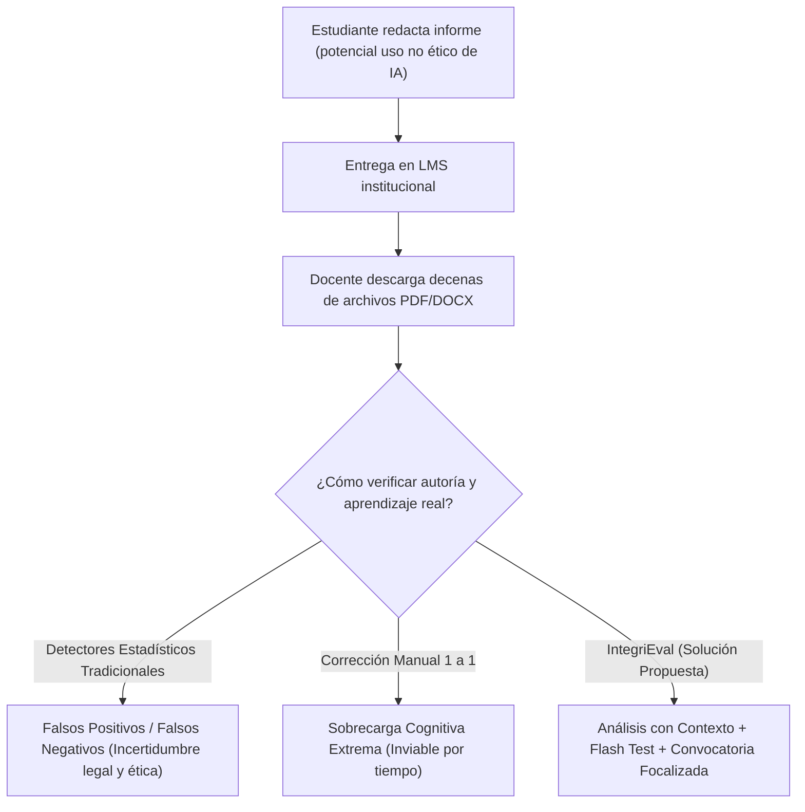
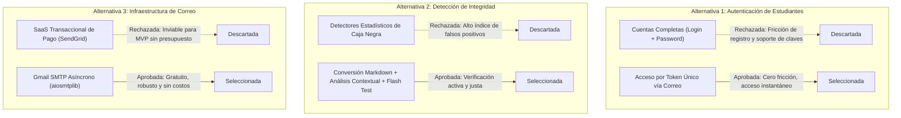

# Documento de Ingeniería de Software y Especificación de Proyecto: IntegriEval

**Proyecto:** IntegriEval — Sistema Semi-Automatizado de Evaluación de Integridad Académica, Detección de IA y Verificación Oral Flash  
**Autores:** Equipo de Desarrollo Estudiantil  
**Fecha:** Agosto 2026  
**Versión:** 2.0.0  

---

## 1. Definición Clara del Problema (10%)

### 1.1 Contexto
La adopción masiva y acelerada de Modelos de Lenguaje Grande (LLMs, por sus siglas en inglés), como Claude, GPT-4 y Gemini, ha transformado drásticamente la educación superior. Si bien estas herramientas ofrecen capacidades analíticas y creativas sin precedentes, han desencadenado una crisis en los métodos tradicionales de evaluación académica basados en informes, ensayos y tareas domiciliarias escritas.

Actualmente, las universidades utilizan plataformas de gestión de aprendizaje (LMS como Moodle, Canvas o Blackboard) donde los estudiantes entregan sus trabajos en formatos digitales (PDF o DOCX). Los docentes y ayudantes se enfrentan al reto de evaluar cientos de páginas escritas sin contar con mecanismos fiables para discernir entre el aprendizaje genuino del estudiante y la generación íntegra o no atribuida de texto mediante IA.



### 1.2 Descripción del Problema
El problema central se articula en torno a tres factores críticos:

1. **Inviabilidad y Riesgo de los Detectores de IA Tradicionales de 'Caja Negra':**
   Herramientas como Turnitin AI Detector o GPTZero basan su dictamen en perplejidad y ráfagas estadísticas (*burstiness*). Diversos estudios académicos han demostrado que estos detectores poseen tasas elevadas de **falsos positivos** (penalizando injustamente a hablantes no nativos o textos técnicos muy formales) y **falsos negativos** (fácilmente eludibles mediante parafraseo o *prompt engineering*). Acusar formalmente a un estudiante basándose exclusivamente en un porcentaje opaco acarrea serios problemas éticos y disciplinarios.

2. **Inviabilidad del Control Presencial Universal:**
   La alternativa infalible para verificar autoría es la defensa oral presencial o interrogación individual. Sin embargo, evaluar oralmente al 100% de los estudiantes en cursos universitarios masivos (60 a 200 alumnos por cátedra) es logísticamente imposible debido a la restricción horaria de los docentes.

3. **Sobrecarga en la Revisión Rúbrica-Material:**
   Los docentes invierten hasta 25 horas semanales corrigiendo manualmente informes, contrastándolos con la pauta y la bibliografía del curso, labor repetitiva que dilata la retroalimentación formativa y merma la calidad pedagógica.

### 1.3 Justificación de Relevancia e Impacto
- **Impacto Ético y Académico:** Garantizar que los títulos otorgados por las instituciones de educación superior certifiquen competencias y habilidades cognitivas reales, preservando la validez del proceso evaluativo.
- **Impacto Operativo:** Reducir en más de un 60% el tiempo invertido por los cuerpos docentes en la corrección mecánica y en la identificación de casos sospechosos.
- **Impacto Económico y de Accesibilidad:** Proveer una solución de código abierto y bajo costo de despliegue (MVP de bajo presupuesto para universidades de Latinoamérica) que no requiera suscripciones SaaS prohibitivas ni infraestructuras complejas.

### 1.4 Percepción de las Partes Interesadas (Stakeholders)

| Parte Interesada | Percepción / Dolores Identificados (*Pains*) | Expectativas y Validación de Relevancia |
|---|---|---|
| **Profesores Titulares** | *"No sé si el alumno aprendió o si apretó un botón en ChatGPT. No tengo tiempo de interrogar a 80 alumnos, pero no puedo acusar a nadie solo porque un software me dice 85% de plagio."* | Requieren una herramienta de apoyo que entregue una nota preliminar justificada, un pool de preguntas personalizado y gestione citas solo para casos anómalos o aleatorios de control. |
| **Ayudantes / TAs** | *"Revisar 100 PDFs idénticos es agotador. Se nos pasa el plagio entre compañeros o el texto copiado de internet."* | Desean poder subir todos los trabajos en lote y contar con resúmenes ejecutivos en Markdown de cada informe. |
| **Estudiantes** | *"Es frustrante que una máquina te acuse de usar IA cuando te esforzaste. Si hay dudas sobre mi trabajo, prefiero que me hagan preguntas sobre lo que yo mismo escribí para demostrar que lo domino."* | Exigen un proceso justo, transparente, sin fricción de cuentas adicionales, y la oportunidad de defender su calificación de forma oral. |
| **Directores de Carrera / Decanaturas** | *"Necesitamos resguardar la reputación de los egresados y evitar litigios por acusaciones infundadas de deshonestidad académica."* | Validan la necesidad de registros de auditoría (*audit trail*) y defensas orales fundamentadas en evidencia tangible. |

---

## 2. Definición de Objetivos SMART y Matriz de Trazabilidad (25%)

### 2.1 Objetivo General
Desarrollar e implementar **IntegriEval**, una plataforma web orientada al docente para la evaluación semi-automatizada de trabajos académicos que integre conversión de documentos a Markdown, análisis de cumplimiento de pauta asistido por IA contextualizada con material de curso, generación de bancos de preguntas flash editables y un sistema de verificación oral focalizado con agendamiento automático en base a la disponibilidad del profesor.

---

### 2.2 Objetivos Específicos (Criterios SMART)

```
┌─────────────────────────────────────────────────────────────────────────────────────────────────────────────────┐
│ OBJETIVO ESPECÍFICO 1 (OE1): Módulo de Ingesta, Nómina y Conversión Estructurada                                │
├─────────────────────────┬───────────────────────────────────────────────────────────────────────────────────────┤
│ Específico (S)          │ Desarrollar el módulo de carga de estudiantes (CSV) y subida masiva de trabajos       │
│                         │ académicos (PDF/DOCX) con conversión automatizada a formato Markdown estructurado.     │
│ Medible (M)             │ Tasa de éxito de conversión >= 98% en documentos estándar y soporte para lotes de     │
│                         │ hasta 100 archivos en una sola operación.                                             │
│ Alcanzable (A)          │ Utilizando la librería de alto rendimiento `pymupdf4llm` y parsing semántico en Python│
│ Relevante (R)           │ Elimina la necesidad de cuentas de estudiantes y estructura el texto para el LLM.     │
│ Temporizado (T)         │ Implementado y validado en la Fase 1 del ciclo de desarrollo.                          │
└─────────────────────────┴───────────────────────────────────────────────────────────────────────────────────────┘
```

```
┌─────────────────────────────────────────────────────────────────────────────────────────────────────────────────┐
│ OBJETIVO ESPECÍFICO 2 (OE2): Motor de Análisis de Rúbrica y Detección Asistida por Contexto                     │
├─────────────────────────┬───────────────────────────────────────────────────────────────────────────────────────┤
│ Específico (S)          │ Implementar un servicio de IA que contraste el informe del alumno contra la pauta del  │
│                         │ docente y los PDFs de material de la materia, generando una nota preliminar y feedback│
│ Medible (M)             │ Tiempo de procesamiento <= 15 segundos por informe en modo asíncrono y generación     │
│                         │ de desglose porcentual por criterio de rúbrica.                                       │
│ Alcanzable (A)          │ Mediante arquitectura de workers en background (FastAPI) y llamadas a Claude 3.5 Sonnet│
│                         │ con fallback resiliente a Mock Engine para desarrollo offline.                        │
│ Relevante (R)           │ Aporta justificación cualitativa y contextual, evitando la arbitrariedad de detectores│
│ Temporizado (T)         │ Completado y probado en la Fase 2 del proyecto.                                       │
└─────────────────────────┴───────────────────────────────────────────────────────────────────────────────────────┘
```

```
┌─────────────────────────────────────────────────────────────────────────────────────────────────────────────────┐
│ OBJETIVO ESPECÍFICO 3 (OE3): Generación, Edición y Despacho del Pool de Preguntas Flash                         │
├─────────────────────────┬───────────────────────────────────────────────────────────────────────────────────────┤
│ Específico (S)          │ Crear un banco de preguntas dinámico (20-30 reactivos por informe) parametrizado por   │
│                         │ rigor (estricto/medio/laxo), con interfaz de edición para el docente y despacho por   │
│                         │ correo electrónico mediante token temporal seguro.                                    │
│ Medible (M)             │ 100% de preguntas asociadas al contenido específico del estudiante, despacho vía SMTP │
│                         │ asíncrono con enlace de 1 solo uso con caducidad configurable (ej. 48h).              │
│ Alcanzable (A)          │ Empleando `aiosmtplib` (Gmail SMTP gratuito sin costo operativo) y tokens UUIDv4.      │
│ Relevante (R)           │ Transfiere el control pedagógico al docente, quien puede adaptar o aprobar el test.   │
│ Temporizado (T)         │ Finalizado en la Fase 3 del proyecto.                                                 │
└─────────────────────────┴───────────────────────────────────────────────────────────────────────────────────────┘
```

```
┌─────────────────────────────────────────────────────────────────────────────────────────────────────────────────┐
│ OBJETIVO ESPECÍFICO 4 (OE4): Plataforma de Flash Test en Tiempo Real y Ruteo Inteligente                        │
├─────────────────────────┬───────────────────────────────────────────────────────────────────────────────────────┤
│ Específico (S)          │ Diseñar la interfaz de examinación en tiempo real para el estudiante (sin login) y el  │
│                         │ algoritmo de ruteo que clasifica resultados y agenda citas de oficina automáticamente.│
│ Medible (M)             │ Latencia de WebSocket <= 100ms, temporización estricta por reactivo (anti-trampas), y │
│                         │ agendamiento automático del 100% de estudiantes que cumplan criterios de revisión.    │
│ Alcanzable (A)          │ Usando WebSockets sobre FastAPI y frontend reactivo en Next.js App Router con Tailwind.│
│ Relevante (R)           │ Focaliza el tiempo presencial del docente únicamente en defensas necesarias.          │
│ Temporizado (T)         │ Integrado y verificado en la Fase 4 del proyecto.                                     │
└─────────────────────────┴───────────────────────────────────────────────────────────────────────────────────────┘
```

---

### 2.3 Matriz de Trazabilidad (Problema vs. Objetivos)

| Dimensión del Problema | Causa Raíz Identificada | Objetivo SMART Vinculado | Resultado Entregable Esperado |
|---|---|---|---|
| **Falsos positivos de detectores IA tradicionales** | Dependencia exclusiva de métricas de perplejidad estadística sin validación de comprensión humana. | **OE2 & OE3** | Evaluación contextualizada con material de curso y generación de preguntas de autoría exclusivas del informe. |
| **Imposibilidad de interrogar al 100% de los estudiantes** | Restricción temporal y sobrecarga de horas de atención del docente en cátedras numerosas. | **OE4** | Ruteo automático: solo rinden defensa oral aquellos con flash score < 50%, >= 95% o el 10% aleatorio de control. |
| **Fricción operativa en adopción de software** | Resistencia de alumnos a crear nuevas cuentas y recordar credenciales para un único examen. | **OE1 & OE3** | Acceso sin cuenta: el docente carga nómina CSV y el alumno ingresa directamente mediante enlace tokenizado por correo. |
| **Evaluaciones genéricas no interdisciplinarias** | Los modelos de IA evalúan de forma aislada sin conocer los contenidos impartidos en clase. | **OE2** | Módulo de *Materiales de Curso* que inyecta el syllabus y guías docentes en el prompt del evaluador. |
| **Falta de control del docente sobre la IA** | Sistemas de evaluación 100% automáticos que no permiten supervisión humana (*Human-in-the-loop*). | **OE3 & OE4** | Interfaz interactiva de edición del pool de preguntas y panel para registrar acuerdos de reunión presencial con ajuste de nota. |
| **Presupuesto cero / Entorno estudiantil** | Costos elevados de APIs de correo transaccional (SendGrid, Mailgun) e infraestructuras de pago. | **OE3** | Utilización de Gmail SMTP gratuito (`aiosmtplib`) y arquitectura modular SQLite/FastAPI/Next.js de bajo consumo. |

---

## 3. Análisis Exhaustivo y Justificado de Requerimientos (45%)

### 3.1 Fundamentación Teórica y Estado del Arte

```
                               ┌───────────────────────────────────────────────────────────┐
                               │             MARCO TEÓRICO DE INTEGRIEVAL                  │
                               └─────────────────────────────┬─────────────────────────────┘
                                                             │
            ┌────────────────────────────────────────────────┼──────────────────────────────────────────────┐
            │                                                │                                              │
            ▼                                                ▼                                              ▼
┌───────────────────────┐                        ┌───────────────────────┐                      ┌───────────────────────┐
│ Evaluación Auténtica  │                        │ Detección Contextual  │                      │ Human-in-the-Loop     │
│ (Wiggins, 1998)       │                        │ vs 'Black-Box'        │                      │ (HITL) en IA EdTech   │
│ Demostración activa   │                        │ Integración de pauta  │                      │ El docente mantiene la│
│ y defensa oral del    │                        │ y bibliografía del    │                      │ decisión y ajuste     │
│ conocimiento.         │                        │ curso en el prompt.   │                      │ final de notas.       │
└───────────────────────┘                        └───────────────────────┘                      └───────────────────────┘
```

1. **Teoría de la Evaluación Auténtica (Grant Wiggins):**
   La evaluación auténtica sostiene que el aprendizaje real se evidencia cuando el estudiante es capaz de articular, defender y aplicar sus conocimientos en situaciones directas de interrogación. IntegriEval traslada el foco desde *"¿el texto fue escrito por una IA?"* hacia *"¿el estudiante domina y puede responder sobre lo que está escrito en su documento?"*.
2. **Limitaciones Documentadas de los Detectores de IA (Sadasivan et al., 2023; Weber-Wulff et al., 2023):**
   Las pruebas empíricas demuestran que los clasificadores binarios de texto de IA poseen precisiones inferiores al 70% en contextos académicos reales. IntegriEval no utiliza la IA como juez punitivo definitivo, sino como un generador de reactivos que el estudiante debe responder con su propio razonamiento en tiempo real.
3. **Paradigma *Human-in-the-Loop* (HITL):**
   Garantiza que la IA nunca emita una sanción o calificación irrevocable sin la mediación, revisión y aprobación explícita del docente titular.

---

### 3.2 Requerimientos Funcionales (RF)

#### Módulo A: Gestión de Cursos y Estudiantes (Docente)
- **RF01 - Gestión de Asignaturas:** El sistema debe permitir al docente crear, listar y administrar cursos, asociando un nombre, periodo académico e institución.
- **RF02 - Carga Masiva de Nómina (CSV):** El sistema debe procesar archivos `.csv` con nombres y correos institucionales de los estudiantes, omitiendo duplicados y validando sintaxis de email.
- **RF03 - Administración Individual de Estudiantes:** El docente debe poder agregar y eliminar estudiantes de un curso sin requerir que estos creen cuentas con contraseña.

#### Módulo B: Configuración de Parámetros y Materiales de Apoyo
- **RF04 - Configuración de Rúbrica y Rigor:** El docente debe poder definir la pauta de corrección en texto libre, seleccionar el nivel de rigor (`strict`, `medium`, `lax`), definir el tamaño del pool de preguntas (ej. 20) y la cantidad para el flash test (ej. 10).
- **RF05 - Carga de Documentos de Referencia:** El sistema debe permitir subir archivos PDF/DOCX de syllabus, guías y bibliografía (hasta 20MB), convirtiéndolos a Markdown e inyectándolos en el contexto de la IA.
- **RF06 - Calibración de Umbrales de Ruteo:** El docente debe poder configurar los umbrales de llamado a oficina (umbral bajo de defensa, umbral alto de excelencia y porcentaje aleatorio de control).

#### Módulo C: Ingesta en Lote y Motor de Análisis IA
- **RF07 - Subida Masiva de Informes:** El sistema debe permitir al docente subir múltiples PDFs/DOCX en una sola acción, asociando cada archivo con el estudiante correspondiente mediante detección heurística de nombre o mapeo manual.
- **RF08 - Extracción de Alta Fidelidad a Markdown:** El sistema debe transformar los documentos de los alumnos a Markdown preservando títulos, listas, tablas y estructura semántica utilizando `pymupdf4llm`.
- **RF09 - Análisis Asíncrono de Rúbrica y Detección de IA:** El sistema debe evaluar en segundo plano cada trabajo contra la pauta y el material, calculando una nota preliminar (0.0–1.0), un índice de probabilidad de IA y un feedback cualitativo detallado.
- **RF10 - Ajuste Manual de Calificación:** El docente debe poder sobrescribir en cualquier momento la nota preliminar asignada por la IA.

#### Módulo D: Gestión del Pool de Preguntas y Despacho
- **RF11 - Visualización del Pool Completo:** El docente debe poder inspeccionar todos los reactivos de opción múltiple y verdadero/falso generados por la IA para cada estudiante.
- **RF12 - Edición y Creación de Preguntas:** El docente debe poder modificar el enunciado, las alternativas, la respuesta correcta o agregar preguntas personalizadas al banco.
- **RF13 - Selección de Preguntas:** El sistema debe ofrecer selección aleatoria automática de $N$ preguntas según la configuración de la evaluación o permitir la selección manual mediante casillas de verificación.
- **RF14 - Despacho Seguro por Correo Electrónico:** Al aprobar el set, el sistema debe generar un token criptográfico único (UUIDv4) con expiración temporal (ej. 48h) y enviar un correo HTML al estudiante con el enlace directo al Flash Test mediante Gmail SMTP asíncrono (`aiosmtplib`).

#### Módulo E: Flash Test Estudiantil en Tiempo Real
- **RF15 - Acceso Tokenizado sin Autenticación Tradicional:** El estudiante debe acceder al examen únicamente a través de la URL `/flash/[token]`, validando vigencia, unicidad y estado de completitud.
- **RF16 - Examen Cronometrado vía WebSocket:** El sistema debe administrar el flujo de preguntas una a una a través de WebSocket bidireccional, aplicando un temporizador estricto del lado del servidor que penalice timeouts.
- **RF17 - Recuperación de Conexión:** En caso de desconexión accidental, el WebSocket debe restaurar la pregunta activa descontando el tiempo transcurrido para evitar reinicios fraudulentos.
- **RF18 - Calificación y Ruteo Inmediato:** Al finalizar la última pregunta, el sistema debe calcular el puntaje, registrar el estado `completed` y, si califica para revisión (bajo, alto o aleatorio), generar automáticamente la cita en la agenda del docente y notificar por correo al alumno.

#### Módulo F: Agenda de Citas, Disponibilidad y Auditoría
- **RF19 - Gestión de Bloques de Disponibilidad:** El docente debe poder registrar y eliminar sus bloques semanales de atención (día de la semana, hora inicio, hora fin).
- **RF20 - Agendamiento Algorítmico de Citas:** El sistema debe buscar el primer bloque libre en la disponibilidad del docente a partir del día siguiente y persistir la cita.
- **RF21 - Registro de Acuerdos de Cita:** El docente debe poder cerrar la cita presencial, ingresar notas justificativas y ajustar la calificación final del informe.
- **RF22 - Registro de Auditoría (Audit Log):** Todas las acciones críticas (creación de curso, análisis, despacho de correos, cambios de notas) deben quedar registradas con marca de tiempo, usuario y detalles en formato JSON.

---

### 3.3 Requerimientos No Funcionales (RNF)

- **RNF01 - Rendimiento y Concurrencia:** La API construida sobre FastAPI y Starlette debe ser capaz de gestionar hasta 100 conexiones WebSocket concurrentes con tiempos de respuesta inferiores a 50ms para el intercambio de mensajes de reactivos.
- **RNF02 - Seguridad y Privacidad de Datos:** Los tokens de acceso al flash test deben ser cadenas UUIDv4 de alta entropía. Las contraseñas de docentes y administradores deben almacenarse con hashing `bcrypt` (factor de costo $\ge 12$).
- **RNF03 - Disponibilidad y Resiliencia:** El servicio de IA debe contar con un mecanismo de *fallback* automático a un motor simulador (Mock AI) en caso de caída o indisponibilidad de la API de Anthropic/Claude, garantizando operatividad continua en entornos de prueba o fallos de red.
- **RNF04 - Usabilidad y Diseño de Interfaz:** El frontend desarrollado en Next.js con Tailwind CSS debe ser completamente responsivo, adaptado a estándares de accesibilidad WCAG 2.1 nivel AA, con tema oscuro de alto contraste y retroalimentación visual inmediata ante estados de carga.
- **RNF05 - Costo Cero de Infraestructura Base:** La arquitectura del MVP debe operar íntegramente con componentes de software libre: SQLite embebido, servidor SMTP estándar de Google y modelos compatibles con ejecución local/híbrida.

---

### 3.4 Evaluación Crítica de Alternativas Técnicas y Justificación



| Componente de Decisión | Alternativas Consideradas | Opción Seleccionada | Justificación Técnica y Práctica |
|---|---|---|---|
| **Modelo de Acceso para Estudiantes** | 1. Registro obligatorio con cuenta y password.<br>2. Integración OAuth con Google/Microsoft institucional.<br>3. Enlace con token de un solo uso despachado al correo. | **Opción 3: Token por Correo** | Reduce a cero la fricción del usuario. El profesor no requiere soporte de recuperación de contraseñas de alumnos. El enlace tokenizado actúa como factor de posesión del correo institucional. |
| **Estrategia de Verificación de Integridad** | 1. Detectores de IA comerciales (Turnitin, Copyleaks).<br>2. Bloqueo de navegación / Proctored Browser.<br>3. Flash Test oral/escrito personalizado con IA. | **Opción 3: Flash Test Contextualizado** | Evita la controversia ética de los falsos positivos. Evalúa el conocimiento real del autor interrogándolo sobre su propio texto y metodología en tiempo real. |
| **Conversión de Documentos** | 1. Extracción de texto plano (pypdf/pdfplumber).<br>2. OCR tradicional (Tesseract).<br>3. Conversión semántica a Markdown (`pymupdf4llm`). | **Opción 3: `pymupdf4llm`** | Preserva la jerarquía de títulos, tablas comparativas y fragmentos de código, permitiendo que el LLM comprenda la estructura lógica del informe con un 40% menos de ruido léxico. |
| **Servicio de Envío de Correos** | 1. Servicios SaaS de pago (SendGrid, Mailgun, Resend).<br>2. Servidor SMTP propio (Postfix en VPS).<br>3. SMTP de Gmail vía `aiosmtplib`. | **Opción 3: Gmail SMTP Asíncrono** | Al tratarse de un MVP universitario con presupuesto cero, una contraseña de aplicación de Google permite enviar hasta 500 correos diarios sin costo alguno y sin dependencias externas complejas. |
| **Arquitectura de Base de Datos** | 1. PostgreSQL en clúster gestionado.<br>2. MongoDB NoSQL.<br>3. SQLite embebido con SQLAlchemy 2.0. | **Opción 3: SQLite + SQLAlchemy** | Portabilidad absoluta para el MVP, cero configuración de servidores externos, soporte de transacciones ACID y migración trivial a PostgreSQL mediante SQLAlchemy en fases posteriores. |

---

## 4. Planificación del Proyecto y Product Backlog Refinado (20%)

### 4.1 Estructura de Épicas y Alineación Estratégica

```
╔══════════════════════════════════════════════════════════════════════════════════════════════════════╗
║                                   ESTRUCTURA DE ÉPICAS DEL BACKLOG                                   ║
╠══════════════════════════════════════════════════════════════════════════════════════════════════════╣
║                                                                                                      ║
║  [ÉPICA 1] Gestión Académica y Nómina Sin Cuentas (Alineada con OE1)                                 ║
║  [ÉPICA 2] Ingesta Masiva, Conversión a Markdown y Base de Conocimiento (Alineada con OE1 y OE2)    ║
║  [ÉPICA 3] Motor de Evaluación Contextual y Detección con IA (Alineada con OE2)                      ║
║  [ÉPICA 4] Gestión Interactiva del Pool de Preguntas Flash (Alineada con OE3)                        ║
║  [ÉPICA 5] Motor de Despacho de Correo y Flash Test en Tiempo Real (Alineada con OE3 y OE4)          ║
║  [ÉPICA 6] Agenda Automatizada de Defensas y Ajuste de Calificaciones (Alineada con OE4)             ║
║                                                                                                      ║
╚══════════════════════════════════════════════════════════════════════════════════════════════════════╝
```

---

### 4.2 Product Backlog Detallado y Priorizado (MoSCoW / Story Points)

*Estimación en Story Points (SP) según escala Fibonacci (1, 2, 3, 5, 8, 13).*

#### 🟢 ÉPICA 1: Gestión Académica y Nómina Sin Cuentas (Alineada con OE1)

##### US-01: Creación y Configuración de Asignaturas
- **Como:** Docente universitario.  
- **Quiero:** Crear mis cursos indicando nombre y periodo lectivo.  
- **Para:** Organizar las evaluaciones de mis asignaturas en un espacio de trabajo aislado.  
- **Prioridad:** *MUST HAVE* | **Estimación:** 3 SP  
- **Criterios de Aceptación (Gherkin):**
  ```gherkin
  Escenario: Creación exitosa de curso
    Dado que he iniciado sesión como docente
    Cuando ingreso el nombre "Inteligencia Artificial" y periodo "2026-1"
    Y presiono "Crear Asignatura"
    Entonces el curso aparece en mi lista lateral y queda seleccionado activamente.
  ```
- **Tareas Técnicas:**
  - `T-01.1`: Crear modelo `Course` en SQLAlchemy y endpoint `POST /api/courses/`.
  - `T-01.2`: Diseñar formulario reactivo en `teacher/dashboard/page.tsx` con feedback de éxito.

##### US-02: Importación de Estudiantes vía CSV
- **Como:** Docente o ayudante de cátedra.  
- **Quiero:** Subir un archivo CSV con la lista de mis alumnos (nombre y correo).  
- **Para:** Registrar a toda la sección en segundos sin que ellos deban crear una cuenta.  
- **Prioridad:** *MUST HAVE* | **Estimación:** 5 SP  
- **Criterios de Aceptación:**
  ```gherkin
  Escenario: Carga masiva con encabezado y caracteres especiales
    Dado un archivo CSV con formato "Nombre,Correo" exportado desde Excel con codificación UTF-8 BOM
    Cuando el docente lo sube en la pestaña "2. Estudiantes"
    Entonces el backend procesa las filas, descarta duplicados en el curso e informa el total de alumnos creados.
  ```
- **Tareas Técnicas:**
  - `T-02.1`: Implementar parser robusto en `api/students.py` con manejo de BOM (`utf-8-sig`) y validación de regex de emails.
  - `T-02.2`: Diseñar vista de tabla en frontend con botón de eliminación individual y contadores.

---

#### 🟢 ÉPICA 2: Ingesta Masiva, Conversión a Markdown y Materiales (Alineada con OE1 y OE2)

##### US-03: Carga de Materiales de Referencia del Curso
- **Como:** Profesor titular.  
- **Quiero:** Subir las guías de estudio, syllabus y pautas de la materia en PDF o Word.  
- **Para:** Que la IA disponga del contexto curricular exacto al momento de evaluar los informes.  
- **Prioridad:** *MUST HAVE* | **Estimación:** 5 SP  
- **Criterios de Aceptación:**
  ```gherkin
  Escenario: Conversión de syllabus a Markdown
    Dado un PDF de 5MB con la pauta de la asignatura
    Cuando el profesor lo sube en "4. Materiales de Apoyo"
    Entonces el sistema ejecuta extract_to_markdown(), almacena el archivo y guarda el texto Markdown en BD.
  ```
- **Tareas Técnicas:**
  - `T-03.1`: Crear modelo `CourseMaterial` y endpoint `POST /api/evaluations/{id}/materials`.
  - `T-03.2`: Integrar servicio `extractor.py` para conversión a Markdown.

##### US-04: Subida en Lote de Informes de Alumnos y Mapeo
- **Como:** Docente o ayudante.  
- **Quiero:** Seleccionar todos los PDFs de informes descargados del LMS universitario en un solo paso.  
- **Para:** No tener que subir los trabajos uno por uno.  
- **Prioridad:** *MUST HAVE* | **Estimación:** 8 SP  
- **Criterios de Aceptación:**
  ```gherkin
  Escenario: Asociación heurística y encolamiento
    Dado un lote de 40 archivos PDF
    Cuando el docente los selecciona en "5. Trabajos"
    Entonces la interfaz sugiere automáticamente el estudiante por coincidencia de nombre/email y permite corregir mapeos antes de iniciar el análisis en segundo plano.
  ```
- **Tareas Técnicas:**
  - `T-04.1`: Implementar endpoint `POST /api/reports/bulk-upload` que reciba `multipart/form-data` y despache `BackgroundTasks`.
  - `T-04.2`: Crear componente de asignación visual en Next.js con autocompletado.

---

#### 🟢 ÉPICA 3: Motor de Evaluación Contextual con IA (Alineada con OE2)

##### US-05: Análisis Automatizado de Pauta y Detección de IA
- **Como:** Profesor evaluador.  
- **Quiero:** Que la IA analice cada informe en base a la pauta y los materiales subidos.  
- **Para:** Obtener una nota preliminar justificada, desglose por criterios y alerta de posible uso de IA.  
- **Prioridad:** *MUST HAVE* | **Estimación:** 8 SP  
- **Criterios de Aceptación:**
  ```gherkin
  Escenario: Procesamiento asíncrono con feedback estructurado
    Dado un informe en estado "processing"
    Cuando la IA completa el análisis con Claude 3.5 Sonnet
    Entonces el reporte pasa a "done", guardando score_percentage, ai_detected_percentage y feedback en JSON.
  ```
- **Tareas Técnicas:**
  - `T-05.1`: Diseñar prompt estructurado en `ai_service.py` con inyección de material de curso y formato JSON estricto.
  - `T-05.2`: Implementar fallback resiliente a `analyze_report_mock()` en caso de ausencia de API Key.

##### US-06: Vista Previa de Markdown y Ajuste de Calificación
- **Como:** Docente.  
- **Quiero:** Leer el informe limpio convertido a Markdown y poder modificar la nota de la IA.  
- **Para:** Mantener el control pedagógico total sobre las calificaciones de mis alumnos.  
- **Prioridad:** *SHOULD HAVE* | **Estimación:** 3 SP  
- **Criterios de Aceptación:**
  ```gherkin
  Escenario: Ajuste manual de nota
    Dado un informe con nota preliminar IA del 60%
    Cuando el docente ingresa "0.75" y presiona "Guardar"
    Entonces final_score_percentage se actualiza a 0.75 y se genera un registro en el log de auditoría.
  ```
- **Tareas Técnicas:**
  - `T-06.1`: Endpoint `PATCH /api/reports/{id}/score` y `GET /api/reports/{id}/markdown`.
  - `T-06.2`: Modal de lectura de código Markdown en frontend.

---

#### 🟢 ÉPICA 4: Gestión Interactiva del Pool de Preguntas Flash (Alineada con OE3)

##### US-07: Editor y Administrador del Banco de Preguntas
- **Como:** Profesor titular.  
- **Quiero:** Ver el pool de 20 preguntas generadas para el informe de un estudiante, editar alternativas o agregar mis propias preguntas.  
- **Para:** Garantizar la pertinencia y calidad académica de las preguntas antes de enviarlas.  
- **Prioridad:** *MUST HAVE* | **Estimación:** 8 SP  
- **Criterios de Aceptación:**
  ```gherkin
  Escenario: Selección aleatoria y agregado personalizado
    Dado un pool de 20 preguntas generadas
    Cuando presiono "Selección Aleatoria (10)"
    Y agrego una pregunta manual de tipo "Verdadero/Falso"
    Entonces las 10 preguntas quedan marcadas con checkbox y la pregunta manual se suma al pool.
  ```
- **Tareas Técnicas:**
  - `T-07.1`: Endpoints CRUD en `api/reports.py` (`/questions`, `/questions/{qid}`, `/select-random`, `/select`).
  - `T-07.2`: Interfaz interactiva en la pestaña "6. Pool de Preguntas" con modal de creación de reactivos.

---

#### 🟢 ÉPICA 5: Motor de Despacho y Flash Test en Tiempo Real (Alineada con OE3 y OE4)

##### US-08: Despacho Asíncrono de Invitaciones por Correo (Gmail SMTP)
- **Como:** Sistema evaluador.  
- **Quiero:** Enviar un correo electrónico estilizado con un link seguro con token de un solo uso al estudiante.  
- **Para:** Que el alumno ingrese a rendir su Flash Test sin necesidad de credenciales.  
- **Prioridad:** *MUST HAVE* | **Estimación:** 5 SP  
- **Criterios de Aceptación:**
  ```gherkin
  Escenario: Generación de token y envío SMTP
    Dado un banco de preguntas aprobado por el docente
    Cuando se ejecuta send_flash_test()
    Entonces se genera un flash_token UUIDv4, se calcula la fecha de expiración y se envía el correo vía aiosmtplib.
  ```
- **Tareas Técnicas:**
  - `T-08.1`: Desarrollar módulo `services/email_service.py` con plantillas HTML y conexión TLS a `smtp.gmail.com`.
  - `T-08.2`: Manejo de excepciones y registro de auditoría (`log_event`).

##### US-09: Interfaz de Rendición Flash Test por WebSocket
- **Como:** Estudiante evaluado.  
- **Quiero:** Responder mis preguntas una a una con un temporizador visual en pantalla.  
- **Para:** Completar la verificación de autoría de mi informe de forma ágil y dinámica.  
- **Prioridad:** *MUST HAVE* | **Estimación:** 8 SP  
- **Criterios de Aceptación:**
  ```gherkin
  Escenario: Control estricto de tiempo y respuesta
    Dado que el estudiante ha abierto su enlace /flash/[token]
    Cuando se inicia la conexión WebSocket
    Entonces el servidor entrega la pregunta con su tiempo límite, valida respuestas de forma atómica y cierra la sesión al finalizar mostrando la clasificación.
  ```
- **Tareas Técnicas:**
  - `T-09.1`: WebSocket en `api/flash.py` con gestión de temporizadores en memoria `ACTIVE_TIMERS`.
  - `T-09.2`: Página interactiva Next.js en `app/flash/[token]/page.tsx` con barra de progreso y manejo de estados.

---

#### 🟢 ÉPICA 6: Agenda de Defensas y Cierre de Calificaciones (Alineada con OE4)

##### US-10: Ruteo Inteligente y Agendamiento Automático de Citas
- **Como:** Plataforma IntegriEval.  
- **Quiero:** Clasificar el resultado del flash test y agendar una cita en el primer bloque libre del profesor si el alumno obtuvo puntaje bajo, alto o fue elegido al azar.  
- **Para:** Coordinar la defensa presencial sin requerir intercambio manual de correos entre alumno y docente.  
- **Prioridad:** *MUST HAVE* | **Estimación:** 5 SP  
- **Criterios de Aceptación:**
  ```gherkin
  Escenario: Convocatoria por puntaje bajo
    Dado un estudiante que obtiene un score flash del 40% (umbral < 50%)
    Cuando process_flash_test_result() finaliza
    Entonces se marca review_required = True, se busca un slot en TeacherAvailability, se crea el Appointment y se despacha el correo de citación.
  ```
- **Tareas Técnicas:**
  - `T-10.1`: Lógica de ruteo algorítmico y búsqueda de slots libres en `services/scheduling.py`.
  - `T-10.2`: Función `send_appointment_email_sync()` en el servicio de correo.

##### US-11: Cierre de Cita y Ajuste Definitivo de Nota
- **Como:** Profesor titular.  
- **Quiero:** Registrar el resultado de la reunión presencial (feedback) y ajustar la nota final del estudiante.  
- **Para:** Concluir el proceso de evaluación de integridad académica formalmente.  
- **Prioridad:** *MUST HAVE* | **Estimación:** 3 SP  
- **Criterios de Aceptación:**
  ```gherkin
  Escenario: Cierre exitoso de defensa presencial
    Dado un estudiante que defendió satisfactoriamente su trabajo
    Cuando el docente ingresa su feedback y nota 0.95 en "8. Citas de Oficina"
    Entonces la cita pasa a estado "completed" y la nota final del informe se actualiza a 0.95.
  ```
- **Tareas Técnicas:**
  - `T-11.1`: Endpoint `POST /api/appointments/{id}/feedback` conectado con la actualización de `Report.final_score_percentage`.
  - `T-11.2`: Panel interactivo de feedback en el dashboard del docente.

---

### 4.3 Resumen de Esfuerzo y Planificación por Fases

```
╔═══════════════════════════════════════════════════════════════════════════════════════════════╗
║                             RESUMEN DE ESTIMACIÓN POR ÉPICA                                   ║
╠═════════════════════════════════════════════════════════════════╦═══════════════╦══════════════╣
║ Épica                                                           ║ Historias     ║ Total SP     ║
╠═════════════════════════════════════════════════════════════════╬═══════════════╬══════════════╣
║ ÉPICA 1: Gestión Académica y Nómina Sin Cuentas                 ║ US-01, US-02  ║ 8 SP         ║
║ ÉPICA 2: Ingesta Masiva, Conversión a Markdown y Materiales     ║ US-03, US-04  ║ 13 SP        ║
║ ÉPICA 3: Motor de Evaluación Contextual y Detección con IA      ║ US-05, US-06  ║ 11 SP        ║
║ ÉPICA 4: Gestión Interactiva del Pool de Preguntas Flash        ║ US-07         ║ 8 SP         ║
║ ÉPICA 5: Motor de Despacho y Flash Test en Tiempo Real          ║ US-08, US-09  ║ 13 SP        ║
║ ÉPICA 6: Agenda de Defensas y Cierre de Calificaciones          ║ US-10, US-11  ║ 8 SP         ║
╠═════════════════════════════════════════════════════════════════╬═══════════════╬══════════════╣
║ TOTAL GENERAL DEL BACKLOG                                       ║ 11 Historias  ║ 61 SP        ║
╚═════════════════════════════════════════════════════════════════╩═══════════════╩══════════════╝
```

---

## 5. Conclusiones y Valor Estratégico

IntegriEval resuelve la encrucijada actual entre la proliferación de herramientas generativas de IA y la necesidad irrenunciable de certificar aprendizajes auténticos en la educación superior. Al reemplazar los detectores tradicionales de 'caja negra' por un **mecanismo híbrido de evaluación contextual, exámenes flash cronometrados y defensa oral focalizada**, la plataforma protege la integridad académica, ahorra cientos de horas hombre docentes y garantiza un trato ético, transparente y libre de fricción para los estudiantes.
