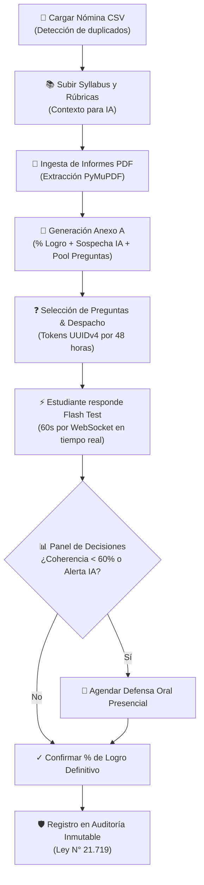

# IntegriEval 🎓⚡
### Sistema Semi-Automatizado de Evaluación de Integridad Académica, Detección Contextual de IA y Verificación Oral Flash

[](https://www.python.org/)
[](https://fastapi.tiangolo.com/)
[](https://opensource.org/licenses/MIT)
[](https://websockets.readthedocs.io/)
[](https://github.com/blosttt/IntegriEval)

* **Proyecto de Título:** INFO1197 — Ingeniería de Software y Título
* **Carrera:** Ingeniería Civil Informática
* **Versión:** 2.0 (Rediseño UI SaaS, Evaluación por % de Logro, Auditoría Inmutable)
* **Entorno:** Educación Superior / Cátedras Universitarias Masivas (60 a 200+ estudiantes)
* **Filosofía:** Evaluación auténtica, costo cero, 100% open-source y cero fricción para estudiantes (sin login).

---

## 1. Fundamentos Teóricos y Filosofía del Sistema

IntegriEval supera las limitaciones de los detectores estadísticos tradicionales de "caja negra" (propensos a falsos positivos y sesgos) y la inviabilidad logística de interrogar manualmente a cientos de estudiantes:

1. **Teoría de la Evaluación Auténtica (Grant Wiggins):** El objetivo pedagógico central no es perseguir heurísticas de texto, sino constatar si el estudiante **comprende, domina y es capaz de defender el contenido y las decisiones técnicas** expuestas en su trabajo.
2. **Evaluación Basada en Porcentaje de Logro (% Logro):** Se prescinde de las calificaciones preliminares numéricas arbitrarias (1.0–7.0) durante el flujo intermedio, unificando la evaluación en el **% de Logro de competencias** (0% a 100%, con umbral de aprobación y validación pedagógica).
3. **Principio de Supervisión Humana (Human-in-the-Loop):** La IA asiste en la extracción semántica y en la generación de preguntas contextuales sobre el informe. La decisión final, la citación a defensa oral y la confirmación del logro definitivo son prerrogativa exclusiva del docente.
4. **Cero Fricción para el Estudiante:** Los estudiantes **no requieren registrarse ni recordar credenciales**. Reciben un enlace seguro con token `UUIDv4` de vigencia acotada (48 h) que abre directamente su sesión cronometrada de Flash Test.
5. **Cumplimiento Normativo (Ley N° 21.719 - Protección de Datos Chile):** Registro inmutable en `audit_logs` con estados previos y nuevos de cada cambio sensible, minimización de datos personales y aislamiento por cátedra (RBAC).

---

## 2. Matriz de Trazabilidad del Blueprint

| Código | Requisito / Dimensión | Implementación en IntegriEval |
|---|---|---|
| **RF-001** | Gestión de Asignaturas y Períodos | `backend/app/routers/asignaturas.py`, entidad `Asignatura` |
| **RF-002** | Ingesta masiva CSV con detección de duplicados | `backend/app/routers/estudiantes.py` (delimitadores auto-detectados `,` y `;`) |
| **RF-003** | Parámetros pedagógicos (rigor, prompt, pool 10-30, umbrales) | `backend/app/routers/asignaturas.py`, `schemas.py` (`ParametrosConfig`) |
| **RF-004** | Materiales de apoyo (Syllabus, guías, rúbricas) | `backend/app/routers/materiales.py`, entidad `Material` |
| **RF-005** | Ingesta PDF individual y masiva con asociación automática | `backend/app/routers/trabajos.py`, `services/pdf_service.py` |
| **RF-006** | Extracción semántica estructurada a Markdown | `backend/app/services/pdf_service.py` (`pymupdf4llm` y `fitz`) |
| **RF-007** | Evaluación estandarizada **Anexo A** | `backend/app/services/mock_engine.py`, `services/llm_service.py` |
| **RF-008** | Generación de Pool de preguntas contextuales (10 a 30) | `backend/app/services/mock_engine.py` (`generate_mock_questions`) |
| **RF-009** | Edición y selección docente de preguntas para el test | `backend/app/routers/preguntas.py`, entidad `Pregunta` |
| **RF-010** | Despacho Flash Test vía Gmail SMTP (Tokens UUIDv4 48h) | `backend/app/services/email_service.py`, `routers/flash_test.py` |
| **RF-011** | Flash Test en tiempo real con WebSockets y timer circular | `frontend/templates/flashtest.html`, `websocket_mgr.py` |
| **RF-012** | Panel de resultados docente en vivo (% Logro, IA, Citas) | `frontend/templates/index.html`, `backend/app/routers/panel.py` |
| **RF-013** | Citación a defensa oral y confirmación justificada de logro | `backend/app/routers/panel.py` (`Cita`, `AuditLog`) |
| **RF-014** | Mock Engine heurístico de contingencia (offline) | `backend/app/services/mock_engine.py` (TTR, burstiness, markers) |
| **RF-015** | Autenticación docente con bcrypt factor $\ge 12$ y JWT | `backend/app/auth.py`, `backend/app/routers/auth.py` |
| **RNF-001** | Concurrencia WebSocket con latencia $\le 50$ms | `backend/app/services/websocket_mgr.py` |
| **RNF-002** | Extracción semántica de informe $\le 15$s CPU | Motor optimizado con `PyMuPDF` |
| **RNF-003** | Confirmación de calificación en API $\le 200$ms | Endpoint `POST /api/asignaturas/{id}/cerrar-nota` directo |
| **RNF-004** | Tokens de acceso seguro UUIDv4 (RFC 4122) | Generación nativa con vigencia de 48 horas |
| **RNF-005** | Cifrado de contraseñas bcrypt con factor 12 | `bcrypt.gensalt(rounds=12)` en `auth.py` |
| **RNF-006** | Control de acceso por roles (Docente, Admin, Ayudante) | `check_course_access()` en `auth.py` |
| **RNF-008** | Resiliencia y reconexión WebSocket $\le 120$s | Sesión y respuestas en memoria preservadas en `websocket_mgr.py` |
| **RNF-009** | Accesibilidad WCAG 2.1 AA y soporte Modo Oscuro/Claro | Variables CSS, alto contraste y selector de tema en vivo |
| **RNF-013** | Trazabilidad inmutable de auditoría (Ley N° 21.719) | Tabla `audit_logs` con registro de diferencias JSON |
| **RN-001** | Tokens con expiración estricta de 48 horas | Validación en base de datos y endpoints públicos |
| **RN-002** | Cronómetro por pregunta con envío reactivo | Timeout automático en frontend y backend |
| **RN-003** | Umbrales parametrizables por cátedra | Almacenamiento JSON configurable en `Asignatura` |
| **RN-004** | Registro obligatorio de justificación pedagógica | Campo auditado en cada cierre de evaluación |

---

## 3. Estructura del Anexo A (Evaluación Estandarizada)

Cada informe procesado genera un desglose pedagógico en formato JSON estandarizado:

```json
{
  "porcentaje_logro": "87%",
  "feedback": {
    "fortalezas": [
      "Estructura general organizada con secciones claramente delimitadas",
      "Integración de conceptos teóricos relevantes para el problema abordado"
    ],
    "debilidades": [
      "Profundidad metodológica mejorable y detalle de validación experimental",
      "Citas bibliográficas y justificación de fuentes requieren mayor exhaustividad"
    ],
    "recomendaciones": [
      "Ampliar la sección de discusión técnica con resultados comparativos",
      "Revisar el formato y contextualización de la bibliografía según norma"
    ]
  },
  "deteccion_ia": {
    "porcentaje": "18%",
    "nivel_confianza": "baja",
    "secciones_sospechosas": [],
    "justificacion": "Variabilidad estilística natural, uso de terminología técnica situada y ritmo de redacción humano"
  },
  "desglose_rubrica": {
    "contenido": "83%",
    "estructura": "91%",
    "ortografia": "89%"
  },
  "evaluacion_respuestas": {
    "nivel_rigor_aplicado": "medium",
    "porcentaje_coherencia": "88%",
    "respuestas_correctas": "9/10",
    "preguntas_falladas": [],
    "observacion_ia": "El informe presenta coherencia metodológica y consistencia argumental adecuada.",
    "requiere_defensa_oral": false
  }
}
```

---

## 4. Arquitectura de Archivos del Proyecto

```
integry/
├── backend/
│   ├── app/
│   │   ├── config.py              # Configuración Pydantic Settings y variables .env
│   │   ├── database.py            # Motor SQLAlchemy y sesión de base de datos SQLite
│   │   ├── models.py              # Modelos ORM (Usuario, Asignatura, Estudiante, etc.)
│   │   ├── schemas.py             # Esquemas Pydantic v2 (Anexo A, DTOs, filtros)
│   │   ├── auth.py                # Bcrypt factor 12, JWT y control de acceso (RBAC)
│   │   ├── audit.py               # Trazabilidad inmutable de auditoría (Ley N° 21.719)
│   │   ├── main.py                # Aplicación FastAPI, lifespan, CORS y montaje estático
│   │   ├── services/
│   │   │   ├── pdf_service.py     # Extracción semántica Markdown con PyMuPDF
│   │   │   ├── mock_engine.py     # Heurísticas de lenguaje natural (TTR, burstiness, markers)
│   │   │   ├── llm_service.py     # Orquestador multi-proveedor LLM con fallback automático
│   │   │   ├── email_service.py   # Despacho Gmail SMTP reactivo (aiosmtplib)
│   │   │   └── websocket_mgr.py   # Gestión de sesiones WebSocket en tiempo real
│   │   └── routers/
│   │       ├── auth.py            # Endpoints de autenticación (/login, /register, /me)
│   │       ├── asignaturas.py     # CRUD de asignaturas y configuración de parámetros
│   │       ├── estudiantes.py     # Ingesta masiva CSV de estudiantes con deduplicación
│   │       ├── materiales.py      # Subida de syllabus y rúbricas (Markdown)
│   │       ├── trabajos.py        # Subida individual/lote de PDFs y evaluación
│   │       ├── preguntas.py       # Pool de preguntas y selección docente
│   │       ├── flash_test.py      # Despacho de tokens y WebSocket de interrogación
│   │       ├── panel.py           # Dashboard docente, citas y confirmación de logro
│   │       └── audit.py           # Consulta de bitácora de auditoría inmutable
│   └── tests/
│       ├── conftest.py            # Fixtures de BD en memoria (SQLite StaticPool)
│       ├── test_auth.py           # Pruebas de hash, JWT y roles
│       ├── test_csv_parser.py     # Pruebas de delimitadores y duplicados en CSV
│       ├── test_evaluation_engine.py # Pruebas del motor de evaluación y Anexo A
│       └── test_flash_test.py     # Prueba del flujo completo Flash Test
├── frontend/
│   ├── static/
│   │   ├── css/
│   │   │   └── style.css          # Design System v2 (Variables, Dark Mode, SaaS components)
│   │   └── js/
│   │       └── app.js             # SPA reactiva, WebSocket docente, modales y toast system
│   └── templates/
│       ├── index.html             # Portal Docente / Admin / Ayudante con demo cards
│       └── flashtest.html         # Vista del estudiante para Flash Test en tiempo real
├── sample_data/
│   ├── nomina_estudiantes.csv     # Nómina de prueba de 10 estudiantes
│   ├── syllabus_info1197.md       # Syllabus de prueba para contexto de IA
│   ├── carlos_alumno_informe_final.pdf # Informe de prueba para extracción y evaluación
│   └── create_sample_pdf.py       # Utilidad generadora de PDFs sintéticos
├── .env.example                   # Plantilla de variables de entorno
├── .gitignore                     # Exclusión de venv, db y archivos temporales
├── pytest.ini                     # Configuración de tests automatizados
├── requirements.txt               # Dependencias Python
├── run.py                         # Lanzador con soporte UTF-8 para consola Windows
└── seed_demo_data.py              # Script generador de datos de demostración completos
```

---

## 5. Puesta en Marcha Rápida (Quickstart)

### Requisitos
* Python 3.10 o superior (verificado en Python 3.13)
* Navegador web moderno (Chrome, Firefox, Edge, Safari)

### 1. Clonar el repositorio
```bash
git clone https://github.com/blosttt/IntegriEval.git
cd IntegriEval
```

### 2. Configurar entorno virtual e instalar dependencias
```powershell
# En Windows (PowerShell)
python -m venv .venv
.venv\Scripts\activate
pip install -r requirements.txt
```

### 3. Ejecutar suite de pruebas unitarias
```powershell
.venv\Scripts\pytest -v
```
*Los 9 tests automatizados cubren autenticación, delimitadores CSV, evaluación Anexo A y ciclo de vida de Flash Test.*

### 4. Cargar datos de demostración (Opcional pero recomendado)
Para poblar la base de datos con 10 estudiantes, informes evaluados, Flash Tests con respuestas simuladas y citas de defensa:
```powershell
.venv\Scripts\python seed_demo_data.py
```

### 5. Iniciar la aplicación
```powershell
.venv\Scripts\python run.py
```
El servidor quedará disponible en: **`http://127.0.0.1:8000`**

---

## 6. Credenciales de Demostración

La pantalla de bienvenida incluye **tarjetas de acceso rápido de un clic** para los distintos roles:

| Rol | Correo | Contraseña | Alcance y Permisos |
|---|---|---|---|
| 🎓 **Docente** | `docente@universidad.cl` | `Docente123!` | Gestión de nómina, informes, pool de preguntas, citas y cierre de logro |
| ⚙️ **Administrador** | `admin@universidad.cl` | `Admin123!` | Supervisión global de asignaturas y bitácora de auditoría completa |
| 🤝 **Ayudante** | `ayudante@universidad.cl` | `Ayudante123!` | Apoyo en revisión de entregas y consulta de panel |

### ⚡ Acceso de Estudiantes (Flash Test)
Los estudiantes **no inician sesión**. Acceden directamente mediante el token único despachado a su correo:
* **Carlos Alumno (Flash 88% - Logro Confirmado):** `http://127.0.0.1:8000/test/demo-token-carlos-001`
* **Pedro González (Sospecha IA 71% - Requiere Defensa Oral):** `http://127.0.0.1:8000/test/demo-token-pedro-003`
* **Felipe Araya (Flash Test Pendiente en Vivo):** `http://127.0.0.1:8000/test/demo-token-felipe-007`

---

## 7. Flujo Operativo del Docente



---

## 8. Licencia y Créditos

* **Desarrollo:** Proyecto de Título — Escuela de Ingeniería Civil Informática (2026).
* **Licencia:** MIT License. Código abierto para fines académicos y formativos.
